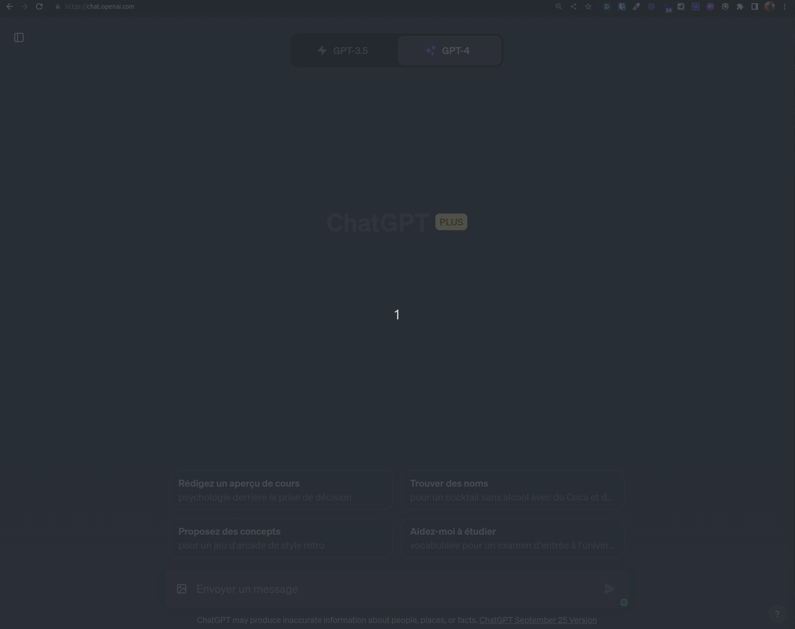
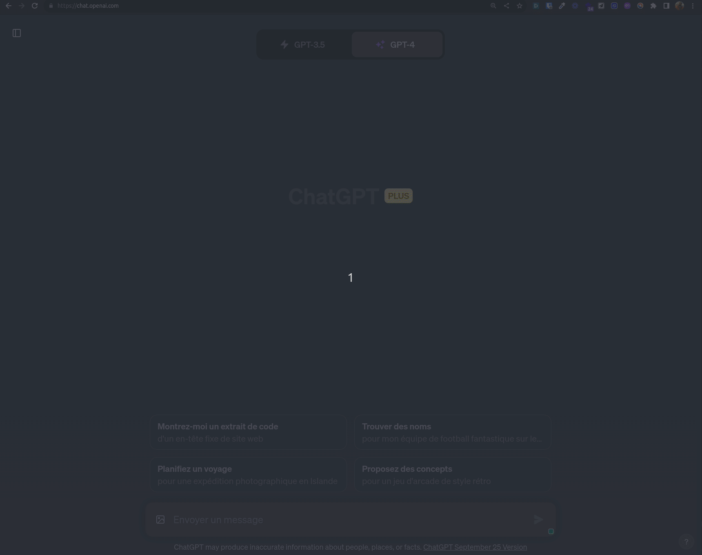

# YoanDevGPT

## Table des matières

- [YoanDevGPT](#yoandevgpt)
  - [Table des matières](#table-des-matières)
  - [Description](#description)
  - [Prérequis](#prérequis)
  - [Avertissement](#avertissement)
  - [Installation](#installation)
    - [Google Chrome](#google-chrome)
    - [Mozilla Firefox](#mozilla-firefox)
  - [Fonctionnalités principales](#fonctionnalités-principales)
  - [Utilisation](#utilisation)
    - [Choisir un prompt](#choisir-un-prompt)
    - [Ajouter sa propre liste de prompts](#ajouter-sa-propre-liste-de-prompts)
  - [Auteurs](#auteurs)
  - [Licence](#licence)

## Description

YoanDevGPT est une extension pour les navigateurs Google Chrome et Mozilla Firefox qui permet d'utiliser une collection de prompts (ou votre propre liste) pour spécialiser le comportement de ChatGPT.

## Prérequis

Pour utiliser cette extension, vous aurez besoin du navigateur Google Chrome ou Mozilla Firefox.

## Avertissement

Cette extension est fournie à titre expérimental.
Vous ne la trouverez pas sur le Chrome Web Store ou le Firefox Add-ons Store.

Libre à vous de l'utiliser tel quel ou de la modifier pour l'adapter à vos besoins.

## Installation

### Google Chrome

Pour installer cette extension en mode développeur, suivez les étapes ci-dessous :

1. Téléchargez la dernière version de l'extension pour Google Chrome depuis la page [Releases](https://github.com/yoanbernabeu/YoanDevGPT/releases/latest)
2. Décompressez l'archive téléchargée.
3. Ouvrez Google Chrome et accédez à `chrome://extensions/`.
4. Activez le mode "Developer mode" (Mode développeur) situé en haut à droite de la page.
5. Cliquez sur "Load unpacked" (Charger l'extension non empaquetée) et sélectionnez le dossier contenant le code source de l'extension.
6. L'extension doit maintenant être installée et prête à l'emploi.

### Mozilla Firefox

Pour installer cette extension en mode développeur, suivez les étapes ci-dessous :

1. Téléchargez la dernière version de l'extension pour Firefox depuis la page [Releases](https://github.com/yoanbernabeu/YoanDevGPT/releases/latest)
2. Ouvrez Firefox et accédez à `about:debugging#/runtime/this-firefox`.
3. Cliquez sur "Load Temporary Add-on..." (Charger une extension temporaire) et sélectionnez le fichier `Firefox_YoanDevGPT.xpi` téléchargé précédemment.

## Fonctionnalités principales

Une fois l'extension installée, elle ajoute une nouvelle option au menu contextuel (clic droit) qui vous permet de sélectionner parmi une liste de prompts pré-renseignés pour spécialiser le comportement de ChatGPT.

Vous pouvez également ajouter vos propres prompts en fournissant l'url d'un fichier JSON contenant un tableau d'objets en vous inspirant du fichier [data.json](./data.json).

## Utilisation

### Choisir un prompt

Pour utiliser l'extension YoanDevGPT, suivez les étapes ci-dessous :

1. Cliquez avec le bouton droit de la souris dans le champ de saisie ChatGPT.
2. Sélectionnez "YoanDevGPT" dans le menu contextuel.
3. Choisissez un prompt dans la liste qui apparaît.

### Ajouter sa propre liste de prompts

Pour ajouter sa propre liste de prompts, suivez les étapes ci-dessous :

1. Créez un fichier JSON contenant un tableau d'objets en vous inspirant du fichier [data.json](./data.json).
2. Hébergez ce fichier sur un serveur web (GitHub, GitLab, etc.).
3. Cliquez avec le bouton droit de la souris sur l'icône de l'extension YoanDevGPT.
4. Renseignez l'url du fichier JSON dans le champ "URL de données" et cliquez sur "Sauvegarder".

## Auteurs

- [Yoan Bernabeu](https://github.com/yoanbernabeu)
- [Pascal Cañadas](https://github.com/leknoppix)

## Licence

Ce projet est sous licence MIT. Voir le fichier [LICENSE](LICENSE) pour plus de détails.

